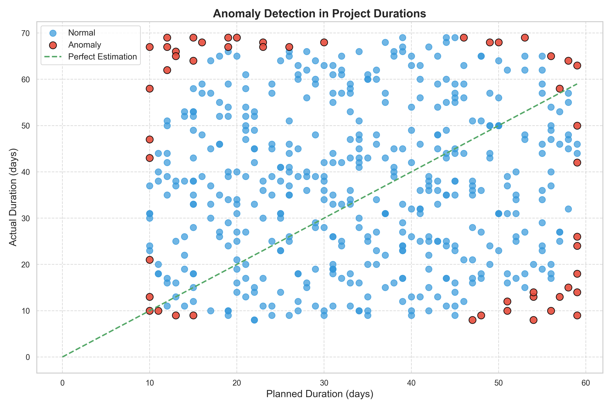
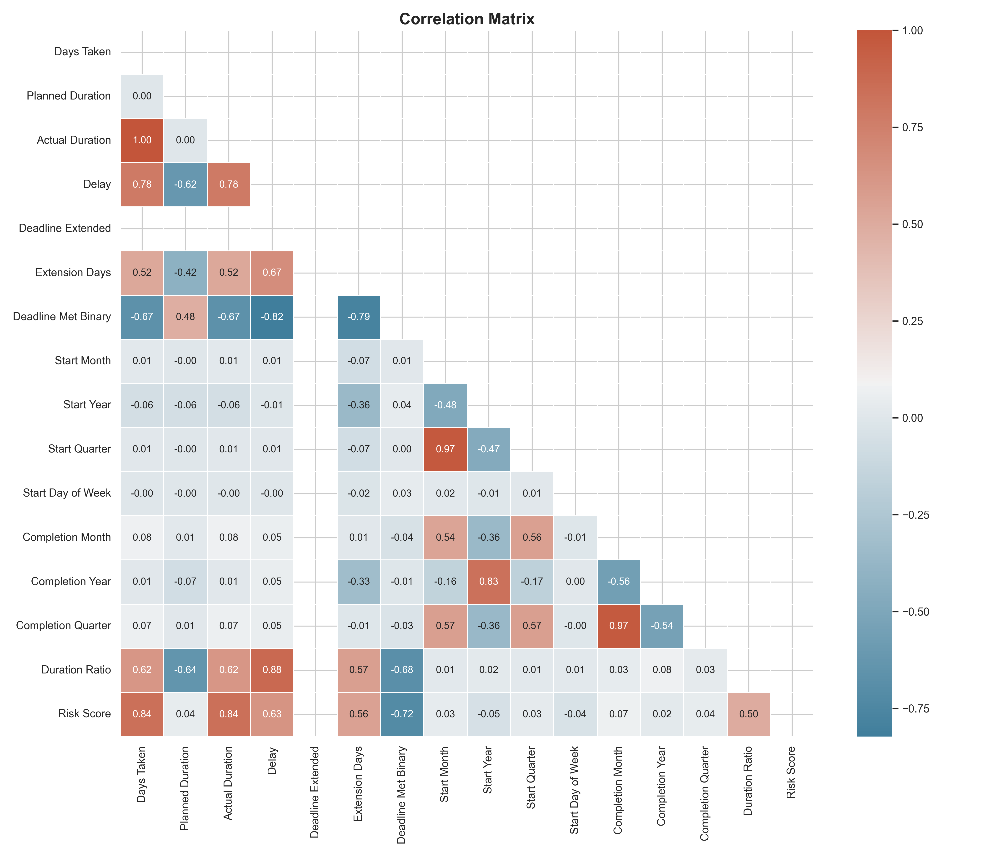
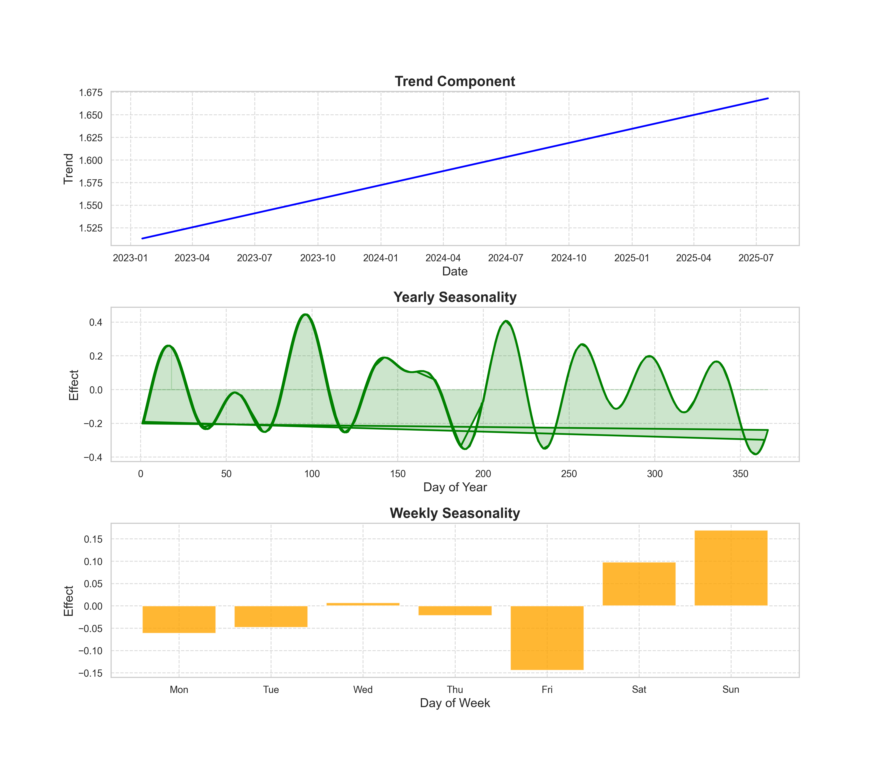
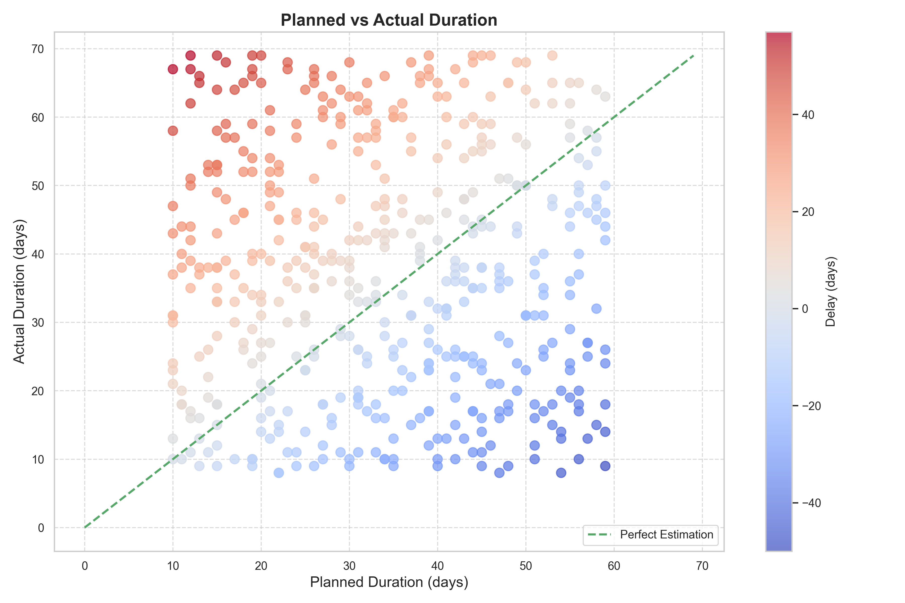
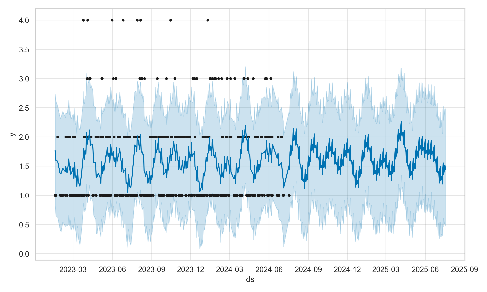
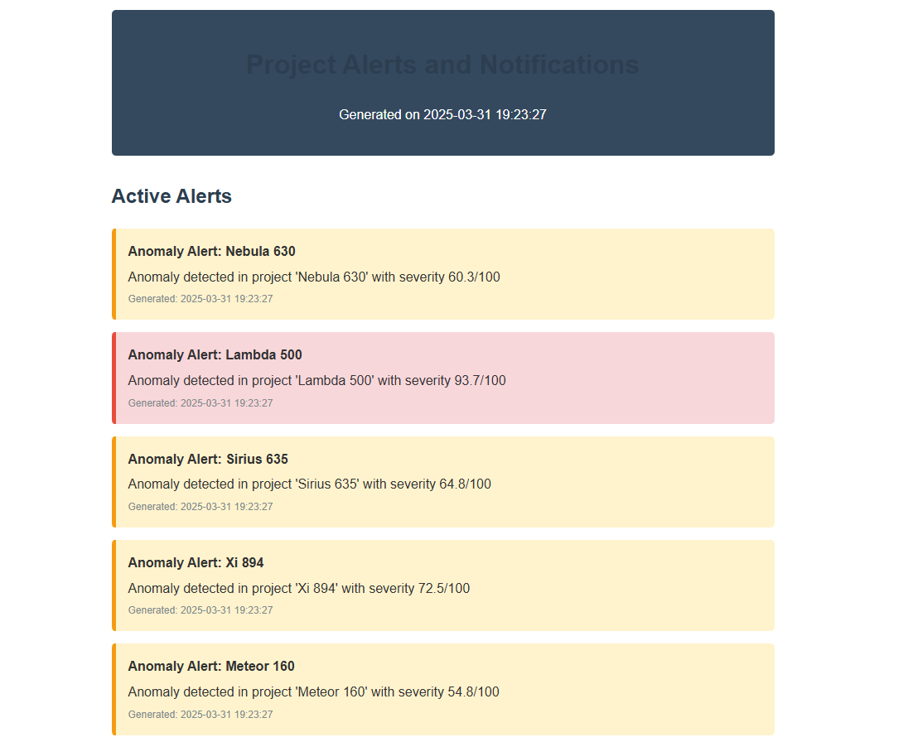

# 🚀 MLTracker - Advanced Project Tracking & Analysis System 📊

## 📌 Overview
**MLTracker** is an advanced **project tracking and analysis** system that leverages **machine learning (ML)** and **data-driven insights** to enhance project performance tracking, efficiency analysis, and anomaly detection. This tool is designed to help project managers, analysts, and data scientists make **informed decisions** using real-time data and predictive analytics.

### 🌟 Key Features:
✅ **Automated Reports** 📑 - Generates detailed reports on project performance, risk assessment, and efficiency metrics.  
✅ **Interactive Dashboards** 📊 - Provides dynamic visualization of project timelines, budgets, and progress tracking.  
✅ **Anomaly Detection** 🚨 - Uses ML-based outlier detection to identify potential risks and inefficiencies.  
✅ **Natural Language Processing (NLP)** 🗣️ - Analyzes project documentation, meeting notes, and feedback for sentiment and key insights.  
✅ **Prophet Forecasting** 🔮 - Predicts future project completion times, budget overruns, and potential delays.  
✅ **Explainable AI (XAI)** 🤖 - Provides transparency into ML model decisions and key influencing factors.  
✅ **Real-Time Monitoring** ⏳ - Continuously updates and monitors project KPIs for actionable insights.  
✅ **Scenario Simulation** 🎭 - Enables testing of different project strategies using simulated data.  
✅ **Alerts & Notifications** 📢 - Notifies users about critical updates, deviations, and action items.  

---

## 🔥 Features Breakdown
### 📥 Data Collection & Ingestion
- Loads **project tracking data** from CSV or other structured formats.
- Supports data integration with APIs and databases for real-time updates.

### 🛠️ Data Cleaning & Feature Engineering
- Converts **date columns** to usable formats.
- Calculates **duration metrics** and identifies trends in task completion.
- Categorizes **delays and bottlenecks** to enhance project decision-making.
- Generates **new insights** through derived features.

### 🧠 Machine Learning Models
- **Classification Models:**
  - Logistic Regression 📉
  - Random Forest 🌲
  - XGBoost ⚡
  - LightGBM 💡
  - CatBoost 🐱
  - Stacking Classifier 🔗
- **Anomaly Detection:**
  - Isolation Forest 🏝️
- **Forecasting:**
  - Prophet 🔮

### 📊 Visualization & Reporting
- **Interactive Dashboards** using **Plotly** 📊.
- **Heatmaps, time-series plots, and statistical reports** 📈.
- **PDF/Excel reports** for easy sharing 📄.

**Anomaly chart**



**Correlation Chart**



**Enhanced_seasonality_components Chart**



**Planned_vs_actual_duration Chart**



**forecast_overview Chart**



**anomaly_detection_dashboard**


**Notification**




---

## ⚙️ Installation
### 🔧 Prerequisites:
Ensure you have **Python 3.7+** installed. 

### 🛠 Install Dependencies:
Run the following command to install all required libraries:
```sh
pip install -r requirements.txt
```

### 🔹 Required Dependencies:
```sh
pandas numpy matplotlib seaborn plotly scikit-learn xgboost lightgbm catboost shap prophet nltk
```

---

## 🚀 Usage Guide
### 🏗️ Running the Script:
To execute MLTracker, use the following command:
```sh
python MLTracker.py
```

### 🔍 Workflow:
1️⃣ **Load & preprocess** project tracking data.  
2️⃣ **Generate insights** through feature engineering.  
3️⃣ **Train & evaluate machine learning models** for classification, anomaly detection, and forecasting.  
4️⃣ **Visualize key metrics** with interactive dashboards and reports.  

---

## 📂 Directory Structure
```
MLTracker/
├── MLTracker.py         # 🏗️ Main script
├── requirements.txt     # 📦 Dependencies
├── data/               # 📂 Raw & processed datasets
├── models/             # 🧠 Trained machine learning models
├── charts/             # 📊 Visualization outputs
├── reports/            # 📑 Generated reports
├── dashboards/         # 🖥️ Interactive dashboards
├── alerts/             # 🔔 Alert notifications
├── SQL data Analysis/  # 📂 SQL queries for project tracking analysis
```

---

## 📜 SQL Analysis
###  **Project Tracker Analysis SQL**
- **Filepath**: `c:\Users\reddy\Downloads\Project Tracking Analysis\SQL data Analysis\Project tracker Analysis.sql`
- **Description**: This SQL file contains advanced queries for analyzing project tracking data. It includes calculations for project health scores, delay analysis, resource utilization, and predictive insights.
- **Key Queries**:
  - **Resource Allocation Analysis**: Identifies common resource issues and their impact on project timelines.
  - **Project Health Trends**: Tracks project health metrics over time.
  - **Dependency Chain Analysis**: Highlights dependencies between projects.
  - **Complexity Score Analysis**: Calculates project complexity based on delays and reasons for missed deadlines.
  - **Predictive Delay Analysis**: Identifies patterns predicting project delays.
  - **Seasonal Trend Analysis**: Analyzes project performance by quarter and year.
  - **Comprehensive Dashboard Query**: Combines multiple metrics into a single dashboard view for high-level reporting.

---

## 🤝 Contributing
🔹 **Submit Issues & Pull Requests**: If you find a bug or have an idea for improvement, feel free to contribute!  
🔹 **Fork & Branch**: Fork the repository and create a new branch before submitting a pull request.  
🔹 **Follow Code Standards**: Maintain clear documentation and use best coding practices.  

---

## 📜 License
This project is licensed under the **MIT License**. See **LICENSE** for details.  

---

## 📞 Contact
Feel free to connect with me on LinkedIn: [Gautam Reddy](https://www.linkedin.com/in/gautam-reddy-359594261/)

💡 *Empower your project tracking with ML-driven insights!* 🚀
